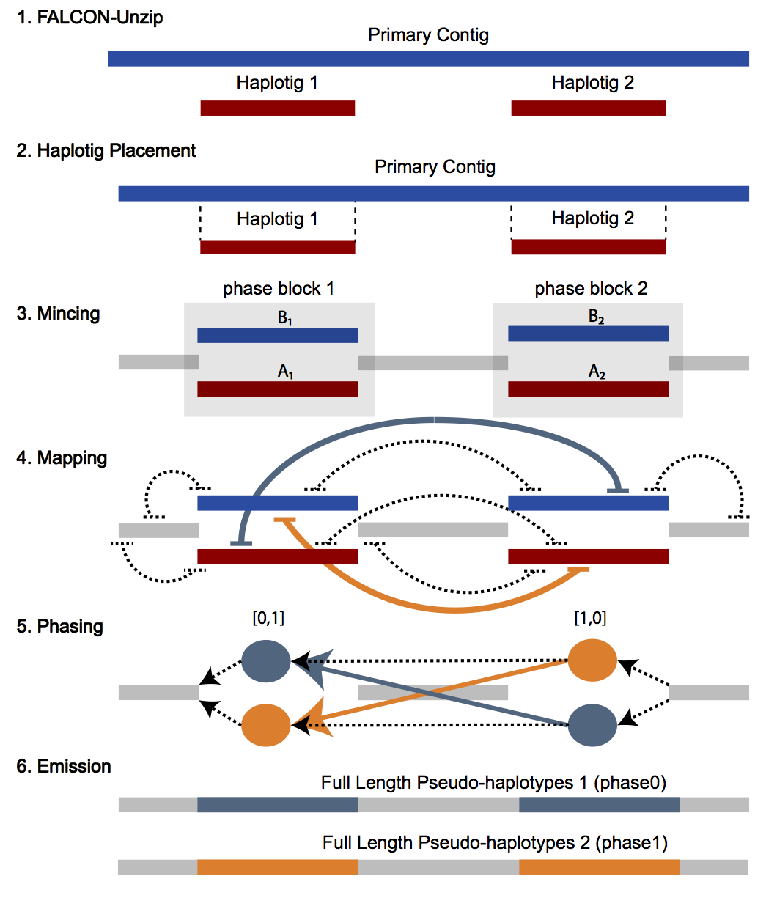

<h1 align="center">pb-assembly</h1>
<p align="center">PacBio Assembly Tool Suite:
    Reads in ⇨ Assembly out
</p>

***
+ [**Availability**](#availability)
+ [**Scope**](#scope)
+ [**General Overview**](#general-overview)
+ [**What's New in PB Assembly**](#whats-new-in-pb-assembly)
+ [**Usage**](#usage)
+ [**Configuration**](#configuration)
+ [**Example Data Set**](#example-data-set)
+ [**Tutorial**](#tutorial)
+ [**FAQ**](#faq)
+ [**Acknowledgements**](#acknowledgements)
+ [**Citations**](#citations)
+ [**Disclaimer**](#disclaimer)

<a name="availability"></a>
# Availability

The latest pre-release, experts-only linux/mac binaries can be installed via [bioconda](https://bioconda.github.io/).

```bash
conda install pb-assembly
```

Alternatively, if you don't have administrator access you can install the pb-assembly suite into an environment 
in your $HOME directory

```bash
conda create -n denovo_asm
source activate denovo_asm
conda install pb-assembly
```
        
Please refer to our [official pbbioconda page](https://github.com/PacificBiosciences/pbbioconda)
for information on Installation, Support, License, Copyright, and Disclaimer.

GitHub issues can be filed [here](https://github.com/PacificBiosciences/pbbioconda/issues) for problems and questions.

If you are looking for a GUI based long read *de novo* genome assembler, you are urged to learn about 
[HGAP4](https://www.pacb.com/videos/tutorial-hgap4-de-novo-assembly-application/)

<a name="scope"></a>
# Scope

_pb-assembly_ is the bioconda recipe encompassing all code and dependencies necessary to
run:

+ FALCON assembly pipeline
+ FALCON-Unzip to phase the genome and perform phased-polishing with Arrow
+ FALCON-Phase to extend phasing between unzipped haplotig blocks (requires HiC data)


Installed package recipes include:

    - pb-falcon
    - pb-dazzler
    - genomicconsensus
    - etc (all other dependencies)

<a name="general-overview"></a>    
# General Overview

## FALCON and FALCON-Unzip
FALCON and FALCON-Unzip are *de novo* genome assemblers for PacBio long reads, also known as 
Single-Molecule Real-Time (SMRT) sequences. FALCON is a diploid-aware assembler which follows 
the hierarchical genome assembly process (HGAP) and is optimized for large genome assembly though microbial 
genomes can also be assembled. FALCON produces a set of primary contigs (p-contigs) as the primary assembly and a 
set of associate contigs (a-contigs) which represent divergent allelic variants. Each a-contig is 
associated with a homologous genomic region on an p-contig.

FALCON-Unzip is a true diploid assembler. It takes the contigs from FALCON and phases the reads 
based on heterozygous SNPs identified in the initial assembly. It then produces a set of partially-phased primary 
contigs and fully-phased haplotigs which represent divergent haplotypes.

## FALCON-Phase
This method maps HiC data to the FALCON-Unzip assembly to fix phase switches between haplotigs within primary contigs. 
Read the [preprint](http://biorxiv.org/cgi/content/short/327064v1) and [manual](https://github.com/phasegenomics/FALCON-Phase/blob/master/README.md). A stand-alone version 1 of the [software](https://github.com/phasegenomics/FALCON-Phase) is available through our co-developer, Phase Genomics. 

## Hierarchical Genome Assembly Process (aka non-hybrid PacBio assembly)
Assembly with PacBio data uses the hierarchical genome assembly process (HGAP). The first round is pre-assembly or error correcction of the long reads. This involves
the selection of seed reads or the longest reads in the dataset (user-defined `length_cutoff`). All 
shorter reads are aligned to the seed reads, in order to generate consensus sequences with high accuracy. 
We refer to these as pre-assembled reads and they can also be thought of as “error corrected” reads. Preassembled 
reads tend to have accuracy > 99%.

In the next round of HGAP, the preads are aligned to each other and assembled into genomic contigs.

Assembly is typically followed by a round of polishing where all raw PacBio subreads are aligned to the draft 
contigs and genomic consensus is performed. Polishing greatly increases base quality of the assembly.

<h1 align="center"></h1>

For more complex genomes assembled with FALCON, “bubbles” in the contig-assembly graph that result 
from structural variation between haplotypes may be resolved as associate and primary contigs. 
The unzip process will extend haplotype phasing beyond “bubble” regions, increasing the amount of phased 
contig sequence. It is important to note that while individual haplotype blocks are phased, phasing does 
not extend between haplotigs. Thus, in part C) of the figure below, haplotig_1 and haplotig_2 may 
originate from different parental haplotypes. Additional information is needed to phase the haplotype 
blocks with each other such as Hi-C, see [FALCON-Phase](https://github.com/phasegenomics/FALCON-Phase) 
as a method for extended phasing.

<h1 align="center"></h1>

FALCON-Phase involves processing the FALCON-Unzip contigs into unzipped blocks (haplotigs pairs) and collapsed haplotypes and then
mappin the HiC data in order to correctly separate the unzipped regions into pahses.

<a name="fp-cartoon"></a>
<h1 align="center"></h1>

<a name="whats-new-in-pb-assembly"></a>
# What's New in PB Assembly

Latest release notes can be found [here](https://github.com/PacificBiosciences/pbbioconda/wiki/Release-notes).

**(September 2018)**

## FALCON
+ Repeat Masking
Integration of Tandem repeat masking (done) and general repeat masking (done)

+ **New!** GFA and Placement Files
-GFA-1 and GFA-2 output for assembly graphs
-placement files for associate contigs (contig.gfa2)

+ Increased Accuracy of Associate Contigs
-algorithm and alignment improvements (Edlib integration)

+ Performance Improvements
-general workflow and resource specification improvements
-easier integration of future features with Pbsmrtpipe

## FALCON-Unzip
+ Improved Haplotig Extraction
-algorithm and data structure improvements reduce haplotype switching and improve extraction
-can now handle circular contigs!

+ **New!** Placement Files
-haplotig placement (PAF format) generated in 3-unzip stage

+ Performance Improvements
-use of minimap2 instead of BLASR for phasing in Unzip significantly reduces runtime 
-unzipping and polishing now part of single workflow
-reduced memory requirements

## FALCON-Phase
+ New integration into pb-assembly pipeline

<a name="usage"></a>
# Usage

## Assemble

```bash
fc_run fc_run.cfg
```

## Unzip and polish
```bash   
fc_unzip.py fc_unzip.cfg
```

## Extended phasing with HiC
```bash   
fc_phase.py fc_phase.cfg
```

<a name="configuration"></a>
# Configuration

Both FALCON and FALCON-Unzip take a config file as their only input parameter.

Here is a sample [fc_run.cfg](cfgs/fc_run_200kb.cfg) that was designed to work with the 200kb test case found
below.

Here is a sample [fc_run.cfg](cfgs/fc_run_human.cfg) that was used with a recent ~2.9Gb human genome assembly.

## FALCON Configuration

The FALCON pipeline has three main steps which occur in distinct directories:

| Subdirectory | Description          
|:---------------------|-----------------------------------------------------------------------
| `0-rawreads` | raw read overlapping and consensus calling, also known as **pre-assembly**                                            |
|`1-preads_ovl`| pre-assembled read overlapping or **pread overlapping**
|`2-asm-falcon`| contig assembly

Many of the tools that comprise 
the FALCON Assembly pipeline were written by Gene Myers and are extensively documented at his 
[dazzlerblog](http://dazzlerblog.wordpress.com).

Below is a breakdown of the configuration options available to FALCON:

### Input

```ini
[General]
input_fofn=input.fofn
input_type=raw
pa_DBdust_option=true
pa_fasta_filter_option=streamed-median
```

Your list of paths to the input fasta files is specified in your `input_fofn` and your `input_type` can be
either `raw` or `preads`. If specifying `preads`, the pipeline will skip the entire `0-rawreads` pre-assembly phase.

By default, dusting is turned on and is run after generating the raw read database with default options as 
recommended by Gene Meyer's. If you wish to modify your 
[dusting parameters](https://dazzlerblog.wordpress.com/command-guides/dazz_db-command-guide/) you can set the 
flag `pa_DBdust_option`.

Filtering options for your input data for pre-assembly can also be set with the `pa_fasta_filter_option` flag. 
The default is `streamed-internal-median` which uses the median-length subread for each 
[ZMW](https://www.pacb.com/smrt-science/smrt-sequencing/) (sequencing reaction well). Choosing the longest 
subread can lead to an enrichment in chimeric molecules. Users will rarely need to change this option from the 
default.

Recognized values are described below. 

|Value | Setting          
|:-----|----------------
|pass  |The no-op filter - passes every FASTA record to the database.                                                                           |
|streamed-median|     Applies the median-length ZMW filter by running a single-pass over the data. The input subreads should be groupped by ZMW.
|streamed-internal-median| Applies the median-length ZMW filter only on internal subreads (ZMWs with >= 3 subreads) by running a single pass over the data. The input subreads should be groupped by ZMW. For ZMWs with < 3 subreads, the maximum-length one is selected.

### Data Partitioning

```ini
# large genomes
pa_DBsplit_option=-x500 -s200
ovlp_DBsplit_option=-x500 -s200

# small genomes (<10Mb)
pa_DBsplit_option = -x500 -s50
ovlp_DBsplit_option = -x500 -s50
```

For the first and second stages of FALCON, the data needs to be read in to a 
[dazzler DB](https://dazzlerblog.wordpress.com/command-guides/dazz_db-command-guide/). The `-x` flag filters 
reads smaller than what's specified while the `-s` flag controls the size of DB blocks. The `-a` option should 
not be used here in conjunction with `pa_fasta_filter_option=pass` as it uses *all reads per ZMW* which can lead 
to errors is preassembly.


### Repeat Masking

```ini
pa_HPCTANmask_option=
pa_REPmask_code=0,300;0,300;0,300
```

Repeat masking occurs in two phases, **Tandem** and **Interspersed**. Tandem repeat masking is run
with a modified version of `daligner` called `datander` and thus uses a similar 
[parameter set](https://dazzlerblog.wordpress.com/command-guides/damasker-commands/). Whatever settings you use
 for pre-assembly daligner overlapping in the next section (`pa_daligner_option`) will be used here for tandem 
 repeat masking. You can supply additional arguments for tandem repeat masking that will be passed to `HPC.TANmask` 
 with the `pa_HPCTANmask_option`.
 
The second phase of masking deals with interspersed repeats and can be run in up to 3 iterations specified with the
`pa_REPmask_code` option. The parameters needed for each iteration are both the group size and coverage specified 
as `group,coverage` pairs separated by semicolons as seen above. 

For information and theory on how to set up your rounds of repeat masking, consult this 
[blog post](https://dazzlerblog.wordpress.com/2016/04/01/detecting-and-soft-masking-repeats/).


### Pre-assembly

```ini
genome_size=1000000000
seed_coverage=30
length_cutoff=-1    
pa_HPCdaligner_option=-v -B128 -M24
pa_daligner_option=-e0.8 -l2000 -k18 -h480  -w8 -s100
falcon_sense_option=--output-multi --min-idt 0.70 --min-cov 3 --max-n-read 400
falcon_sense_greedy=False
```
During pre-assembly, the PacBio subreads are aligned and error correction is performed. The longest subreads are 
chosen as *seed reads* and all shorter reads are aligned to them and consensus sequences are generated from the 
alignments. These consensus sequences are called *pre-assembled reads* or `preads` and generally have accuracy 
greater than 99% or QV20.

If you wish to auto-calculate your seed read coverage, then it's necessary to enter your `genome_size` in base
pairs, the desired `seed_coverage` as well as set `length_cutoff=-1` to force the auto-calculation. We generally 
recommend `20-40x` seed coverage. Alternatively, if you don't know your genome size, are unsure of the `seed_coverage` 
you would like to use or if you would rather just leverage all reads above a specific length, you can use the the 
`length_cutoff` flag to manually set that limit. It's important to note that whatever value `length_cutoff` gets set 
to is a limit that carries through to the unzipping algorithm, and any reads smaller than that cutoff will not be 
used for phasing. For assembly alone, there is likely no harm in setting a high `length_cutoff`, unless you are 
expecting a certain feature like micro chromosomes or short circular plasmids. Howevere, if you are planning to unzip, 
then you will be artificially limiting your phasing dataset and it's probably in your interest to have a 
lower `length_cutoff`. The majority of computation occurs in preassembly so if compute time is important to you, 
increasing `length_cutoff` will increase efficiency but with the tradeoffs described above.
 
Overlap options for `daligner` are set with the `pa_HPCdaligner_option` and `pa_daligner_option` flags. Previous 
versions of FALCON had a single parameter. This is now split into two flags, one that affects requested 
resources `pa_HPCdaligner_option` and one that affects the overlap search `pa_daligner_option`.
For `pa_HPCdaligner_option`, the `-v` parameter is passed to the `LAsort` and `LAmerge` programs while `-B` and `-M` 
parameters are passed to the `daligner` sub-commands.

To understand the theory and how to configure `daligner` see 
[this blog post](https://dazzlerblog.wordpress.com/2014/07/10/dalign-fast-and-sensitive-detection-of-all-pairwise-local-alignments/)
and this [command reference guide](https://dazzlerblog.wordpress.com/command-guides/daligner-command-reference-guide/).

For `daligner`, in general we recommend the following:

`-e`: *average correlation rate* (average sequence identity)

`0.70` (low quality data) - `0.80` (high quality data). A higher value will help prevent haplotype collapse.

`-l`: *minimum length of overlap*

`1000` (shorter library) - `5000` (longer library)

`-k`: *kmer size*

`14` (low quality data) - `18` (high quality data)

Lower values of `-k` have higher sensitivity at the tradeoff of increased diskspace, memory consumption and 
slower run time and tend to work best with lower quality data. In contrast, a larger *kmer* value for `-k` has a 
higher specificity, uses less system resources and runs faster, but will only be suitable for high quality data.
 
You can configure basic pre-assembly consensus calling options with the `falcon_sense_option` flag. The `--output-multi`
flag is necessary for generating proper fasta headers and should not be removed unless your specific use case requires 
it. The parameters `--min-idt`, `--min-cov` and `--max-n-read` set the minimum alignment identity, minimum 
coverage necessary and max number of reads, respectively, for calling consensus to make the preads.

By default, `-fo` are the parameters passed to `LA4Falcon`. The option `falcon_sense_greedy` changes this
parameter set to `-fog` which essentially attempts to maintain relative information between reads that have 
been broken due to regions of low quality.


### Pread overlapping

```ini
ovlp_daligner_option=-e.96 -s1000 -h60
ovlp_HPCdaligner_option=-v -M24 -l500
```

The second phase of error-corrected read overlapping occurs in a similar fashion to the overlapping performed in the
pre-assembly, however no repeat masking is performed and no consensus is
called. Overlaps are identified and fed into the final assembly. The parameter options work the same 
way as described above in the pre-assembly section.

Recommendation for *preads*: 

`-e`: *average correlation rate* (average sequence identity)

`0.93` (inbred) - `0.96` (outbred)

`-l`: *minimum length of overlap*

`1800` (poor preassembly, short/low quality library) - `6000` (long, high quality library)

`-k`: kmer size

`18` (low quality) - `24` (most cases)

### Final Assembly

```ini
overlap_filtering_setting=--max-diff 100 --max-cov 100 --min-cov 2
fc_ovlp_to_graph_option=
length_cutoff_pr=1000
```

The option `overlap_filter_setting` allows setting criteria for filtering pread overlaps. 
`--max-diff` filters overlaps that have a coverage difference between the 5' and 3' ends larger than specified. 
`--max-cov` filters highly represented overlaps typically caused by contaminants or repeats and `--min-cov` allows
specification of a minimum overlap coverage. Setting `--min-cov` too low will allow more overlaps to be detected
at the expense of additional chimeric / mis-assemblies.
    
`length_cutoff_pr` is the minimum length of pre-assembled *preads* used for the final assembly. Typically, this value 
is set to allow for approximately 15 to 30-fold coverage of corrected reads in the final assembly.

### Miscellaneous configuration options

Additional configuration options that don't necessarily fit into one of the previous categories are described here.


```ini
target=assembly
skip_checks=False
LA4Falcon_preload=false
```

FALCON can be configured to stop after any of its three stages with the `target` flag set to either
`overlapping`, `pre-assembly` or `assembly`. Each option will stop the pipeline at the end of its corresponding
stage, `0-rawreads`, `1-preads_ovl` or `2-asm-falcon` respectively. The default is full `assembly` pipeline.

The flag `skip_checks` disables `.las` file checks with `LAcheck` which has been known to cause errors on certain
systems in the past.

The option `LA4Falcon_preload` passes the `-P` parameter to `LA4Falcon` which causes all the reads to be loaded
into memory. On slow filesystems this can speed things up significantly; but it will dramatically increase the 
memory requirement for the consensus stage.

### Job Distribution

```ini
[job.defaults]
job_type=sge
pwatcher_type=blocking
JOB_QUEUE = default
MB = 32768
NPROC = 6
njobs = 32
submit = qsub -S /bin/bash -sync y -V  \
  -q ${JOB_QUEUE}     \
  -N ${JOB_NAME}      \
  -o "${JOB_STDOUT}"  \
  -e "${JOB_STDERR}"  \
  -pe smp ${NPROC}    \
  -l h_vmem=${MB}M    \
  "${JOB_SCRIPT}"

[job.step.da]
NPROC=4
MB=49152
njobs=240
```

Default job configuration options are specified in the `[job.defaults]` section of your config file. The first option
you should set that controls the flow of your job is the process watcher, `pwatcher_type`. There two possible values 
you can set, either `blocking` or `fs_based`. `fs_based` is the default and relies on the pipeline polling the file 
system periodically to determine whether a `sentinel` file has appeared that would  signal the pipeline to continue. 
The other option is to use a `blocking` process watcher which can help with systems that have issues with filesystem 
latency. In this case, the end of the job is determined by the finishing of the system call, rather than by file 
system polling.
 
The next most important option is the `job_type`. Allowed values are `sge`, `pbs`, `torque`, `slurm`, `lsf` and `local`. 
If running on a cluster, you need to configure the `submit` string to work with your job scheduler. The `submit`
string in the sample above is a tested and working SGE submit string. 

Some example `job_type` configurations and `submit` string are listed for convenience in the following table. 
You may need to modify some of the parameters to work with your job scheduler.

|job_type| submit
|--------|-------
|`local`   | <code>bash -C ${CMD} >&#124; ${STDOUT_FILE} 2>&#124; ${STDERR_FILE}</code>
|`sge` | <code>qsub -S /bin/bash -sync y -V -q myqueue -N ${JOB_NAME} -o "${JOB_STDOUT}" -e "${JOB_STDERR}" -pe smp ${NPROC} -l h_vmem=${MB}M "${JOB_SCRIPT}"
|`lsf` | <code>bsub -K -q myqueue -J ${JOB_NAME} -o ${JOB_STDOUT} -e ${JOB_STDERR} ${JOB_SCRIPT}</code>
|`slurm` | <code>srun --wait=0 -p myqueue -J ${JOB_NAME} -o ${JOB_STDOUT} -e ${JOB_STDERR} --mem-per-cpu=${MB}M --cpus-per-task=${NPROC} ${JOB_SCRIPT}

For further information about how to configure for job schedulers other than SGE (PBS/LSF/Slurm/hermit) see the 
[pypeflow wiki](https://github.com/PacificBiosciences/pypeFLOW/wiki/configuration)


Next you will find your job distribution settings. You will find settings for your default job queue `JOB_QUEUE`, 
memory allocated per job `MB`, number of processors per job `NPROC` as well as number of concurrently running 
jobs `njobs`. 

Each stage of the assembly pipeline can be given different default parameters with different `[job.step.*]` sections.
There are 6 optional stages you can configure by using different 2-3 letter codes. `da` and `la` refer to 
pre-assembly daligner jobs and pre-assembly LAshow/LAsort jobs respectively. `cns` refers 
to the pread consensus calling stage. `pda` and `pla` refer to the pread daligner overlapping and pread
LAshow/LAsort stages respectively while `asm` refers to the final assembly. If you omit a specific `[job.step.*]` 
section, the `[job.defaults]` will be applied. `[job.step.da]`, `[job.step.la]`, `[job.step.cns]`, `[job.step.pda]`, 
`[job.step.pla]`, and `[job.step.asm]` are the available sections.
 
 
## FALCON-Unzip Configuration

FALCON-Unzip has two main steps which occur in distinct directories:

| Subdirectory | Description          
|:---------------------|-----------------------------------------------------------------------
| `3-unzip` | read alignment, SNP calling, read phasing, and diploid assembly of primary contigs and haplotigs                           
|`4-polish`| phased polishing in which reads are used to polish in a haplotype-specific manner using BLASR and arrow


```ini
[General]
max_n_open_files = 1000
[Unzip]
input_fofn=input.fofn
input_bam_fofn=input_bam.fofn
```

FALCON-Unzip configuration is quite simple as the majority of the options have to do
exclusively with job distribution. The first and only setting in the [General] section is for `max_n_open_files`.
During the read tracking stage the pipeline can be writing to many `.sam` files at the same time. This can cause
problems with certain networked filesystems, so the default is to set `max_n_open_files=300`. Feel free to raise
this number if file system latency is not an issue for you.

Similar to FALCON, the parameter `input_fofn` simply refers to the input file of fasta names. This setting should
be redundant with your `fc_run.cfg`. Finally, if you wish to polish your unzipped genome, you will need to also 
specify a list of your input bam files with `input_bam_fofn`.

Here is a sample [fc_unzip.cfg](cfgs/fc_unzip.cfg) that will need to be tuned to your compute environment.

### Job Distribution

Configuration of your `[job.defaults]` section is identical to FALCON as described previously. The only differences
 are the job specific settings specific to FALCON-Unzip. Available sections are `[job.step.unzip_track_reads]`, 
`[job.step.unzip_blasr_aln]`, `[job.step.unzip.phasing]` and `[job.step.unzip.hasm]`

## FALCON_Phase configuration

An example [fc_phase.cfg](cfgs/fc_phase.cfg).

*stay tuned for better documentation on falcon phase*

<a name="example-data-set"></a>
# Example Data Set

To test your installation above you can download and run this small 200kb test case. 

```bash
git clone https://github.com/cdunn2001/git-sym.git
git clone https://github.com/pb-cdunn/FALCON-examples.git
cd FALCON-examples
../git-sym/git-sym update run/greg200k-sv2

```

Once you have the data, you can test the pipeline in local or distributed mode by editing the fc_run.cfg file found
in the run directory.

```bash
cd run/greg200k-sv2
fc_run fc_run.cfg
fc_unzip.py fc_unzip.cfg
```

If everything was installed properly the test case will exit cleanly and you should find fasta files with a  
size greater than 0 in the `4-polish/cns-output` directory.


<a name="tutorial"></a>
# Tutorial

In this section we will run the full pb-assembly pipeline, `FALCON`, `FALCON-Unzip`, and `FALCON-Phase` 
on a test dataset. The data is subsampled from the F1 bull from [Koren et al. 2018](https://doi.org/10.1038/nbt.4277); 
full dataset is available at NCBI BioProject [PRJNA432857](https://www.ncbi.nlm.nih.gov/bioproject/?term=PRJNA432857).
We will work through the commands and results and give you ideas of how to assess 
the perfomance of pb-assembly on your dataset so you can modify parameters and trouble-shoot more 
effectively.

This tutorial was run using v0.0.2 of the pb-assembly bioconda metapackage. 


## Prepare data and directory

### 1. Download F1 bull dataset

The dataset can be download [here](https://downloads.pacbcloud.com/public/dataset/assembly_test_data/)
and then unpacked. e.g.:

```bash
$ wget https://downloads.pacbcloud.com/public/dataset/assembly_test_data/F1_bull_test_data.tar.gz
$ tar -xvzf F1_bull_test_data.tar.gz  
```

Inside the ``F1_bull_test_data/`` directory you'll find the following files with md5sums so you can be sure 
the file transfer is complete.

```bash
00e1c1ad1d33e4cd481747d7efdffcc0  F1_bull_test.subreads.fasta.gz - PacBio subreads for falcon assembly
6cf93f0d096ddf0ce3017f25c56ff7e4  F1_bull_test.HiC_R2.fastq.gz - HiC data for falcon phase
ce8f6057e07459bb091ceeca7f6ff04e  F1_bull_test.HiC_R1.fastq.gz - HiC data for falcon phase
39ec303e6527dd227770cd33dbdb3609  fc_run.cfg  - contig file for fc_run (falcon)
c52064770d25def32974e7a11211d9c8  fc_unzip.cfg  - contig file for fc_unzip.py
51dc7c9e1e26c44d9cc5f5e491f53d2b  fc_phase.cfg  - config file for fc_phase.py
81033c7c4ed46fe8b1c89e9d33cc1e84  F1_bull_test.subreads.bam - PacBio subreads for unzip
```

### 2. Create FOFN

Next, create two "files-of-file-names", ("fofn") for the PacBio subread data in fasta and bam format.
You need the `subreads.fasta` for FALCON and FALCON-Unzip and the `subreads.bam` for the polishing step
of FALCON-Unzip.

```bash
$ cat subreads.fasta.fofn	
/path/to/my/data/dir/F1_bull_test.subreads.fasta
	
$ cat subreads.bam.fofn
/path/to/my/data/dir/F1_bull_test.subreads.bam
```

### 3. Modify config files

You can use the three configuration files, `fc_run.cfg`, `fc_unzip.cfg`, and `fc_phase.cfg`, from the tarball 
as a starting point but you will need to adjust the resource allocation for your particular compute setup.
Consult the detailed [Configuration](#configuration) section for more information.


### 4. Activate pb-assembly environment

```bash
source activate my-pbasm-env
(my-pbasm-env) $
```
See the [Availability](#availability) section for more details about installation and set up from bioconda.

Make sure you are using ``screen`` or ``tmux`` or sending your job to a cluster scheduler so your job persists.


## Run FALCON

You're good to go! Let's run it!

```bash
(my-pbasm-env) $ fc_run fc_run.cfg  
```

FALCON prints a lot to screen to help you monitor your job. I like to run my job in the background and capture
both stderr and stdout for later trouble shooting, if needed. I find that not all useful information is captured in the ``all.log`` file,
in particular scheduler/cluster or connectivity errors tend to print to screen.

```bash
(my-pbasm-env) $ fc_run fc_run.cfg &> run0.log &
```

### Checking on job progress

#### 1. How many jobs are left?

The majority of run-time is spent in preassembly; this version of FALCON relies on daligner for subread overlapping.

For example, to see how many daligner jobs there are (hint, there are 9 for the test data):

```bash
$ ls 0-rawreads/daligner-chunks/ | wc -l
9
```

To see how many jobs have completed, count the sentinal files in the daligner-run dirs.

```bash
$ find 0-rawreads/daligner-runs/j_*/uow-00 -name "daligner.done" | wc -l
9
```

Yo, initial overlaps are done!


#### 2. What step is running?

It is also helpful to know what stage an individual job is running. On an SGE cluster, for example, I can get at list of my running processes like this:

```bash
$ qstat | grep myname
9580947 1.03953 Pf02af7214 myname  r     11/16/2018 15:12:12 bigmem@mp1306-sge66                8        
9580952 1.03953 P1f6ce5c60 myname  r     11/16/2018 15:12:12 bigmem@mp1304-sge66                8        
9580954 1.03953 P941e007f7 myname  r     11/16/2018 15:12:12 bigmem@mp1304-sge66                8        
9580957 1.03953 Ped31ec762 myname  r     11/16/2018 15:12:12 bigmem@mp1304-sge66                8        
9580959 1.03953 Pa1c326bb0 myname  r     11/16/2018 15:12:12 bigmem@mp1301-sge66                8        
```

And I can get details about these processes like this:

```bash
$ qstat -j 9580947
```

The above command outputs all sorts of useful information like stderr paths and submission times:

```bash
...
stdout_path_list:           NONE:NONE:/path/to/my_job_dir/1-preads_ovl/daligner-runs/j_0077/run-Pf02af721455dae.bash.stdout
...
submission_time:            Fri Nov 16 15:12:09 2018
...
```

### Read Stats

The first step in FALCON is to build a dazzler database. From the `0-rawreads/build/raw_reads.db` you can easily extract 
a histogram of read lengths for the subreads used in assembly. In addition, the total base pairs can be used to calculate
raw subread coverage if you know your genome size. You may notice that the base pairs from the dazzDB is lower than the total yield of 
your SMRT cells, particulary if you are using version 3.0 chemistry of sequel. Consult the [FAQ](#what-coverage) section for more details.

```bash
(my-pbasm-env) $ DBstats raw_reads.db

Statistics for all reads of length 500 bases or more

        116,757 reads        out of         116,757  (100.0%)
  1,625,908,631 base pairs   out of   1,625,908,631  (100.0%)

         13,925 average read length
          8,316 standard deviation

  Base composition: 0.297(A) 0.199(C) 0.212(G) 0.292(T)

  Distribution of Read Lengths (Bin size = 1,000)

        Bin:      Count  % Reads  % Bases     Average
     68,000:          1      0.0      0.0       68655
     67,000:          0      0.0      0.0       68655
     66,000:          0      0.0      0.0       68655
     65,000:          3      0.0      0.0       66171
     64,000:          0      0.0      0.0       66171
     63,000:          0      0.0      0.0       66171
     62,000:          1      0.0      0.0       65359
     61,000:          2      0.0      0.0       64282
     60,000:          0      0.0      0.0       64282
     59,000:          3      0.0      0.0       62735
...
```

You can extract the same information from the preads:

```bash
(my-pbasm-env) $ DBstats 1-preads_ovl/build/preads.db                     

Statistics for all reads of length 70 bases or more

         39,573 reads        out of          39,573  (100.0%)
    558,983,583 base pairs   out of     558,983,583  (100.0%)

         14,125 average read length
          8,124 standard deviation

  Base composition: 0.299(A) 0.200(C) 0.200(G) 0.300(T)

  Distribution of Read Lengths (Bin size = 1,000)

        Bin:      Count  % Reads  % Bases     Average
     57,000:          2      0.0      0.0       57484
     56,000:          0      0.0      0.0       57484
     55,000:          1      0.0      0.0       56712
     54,000:          0      0.0      0.0       56712
     53,000:          1      0.0      0.0       55899
     52,000:          3      0.0      0.1       54468
     51,000:          4      0.0      0.1       53341
     50,000:          2      0.0      0.1       52870
     49,000:          6      0.0      0.2       51819
     48,000:          4      0.1      0.2       51221
     47,000:          9      0.1      0.3       50182
     46,000:          4      0.1      0.3       49768
     45,000:          9      0.1      0.4       48911
     44,000:         11      0.1      0.5       48052
...
```

### Pre-assembly Performance

In addition to the DBstats command, consult the `0-rawreads/report/pre_assembly_stats.json` file for details about
pre-assembly performance:

```bash
$ {
    "genome_length": 20000000,
    "length_cutoff": 17886, # calculated min length of seed reads when "autocut" (length_cutoff = -1) is used. 
    "preassembled_bases": 558983583,
    "preassembled_coverage": 27.949,
    "preassembled_esize": 18798.024,
    "preassembled_mean": 14125.378,
    "preassembled_n50": 18750,
    "preassembled_p95": 28394,
    "preassembled_reads": 39573,
    "preassembled_seed_fragmentation": 1.507, # number split preads / seed reads
    "preassembled_seed_truncation": 3475.765, # ave bp lost per pread due to low cov
    "preassembled_yield": 0.699,              # total pread bp / seed read bp (>50% is acceptable)
    "raw_bases": 1625908631,
    "raw_coverage": 81.295,
    "raw_esize": 18892.366,
    "raw_mean": 13925.577,
    "raw_n50": 17703,
    "raw_p95": 30005,
    "raw_reads": 116757,
    "seed_bases": 800080383,
    "seed_coverage": 40.004,
    "seed_esize": 26357.341,
    "seed_mean": 24841.045,
    "seed_n50": 24687,
    "seed_p95": 36872,
    "seed_reads": 32208
}
```

A note on these statistics: in the process of created preads, seeds reads with insufficient raw read coverage 
(falcon_sense_option = --min_cov option) will be split or truncated. The preassembled seed fragmentation, truncation, 
and yield stats summarize the quality of pread assembly. A good preassembled yield should be greater than 50%. Often
coverage-limited assemblies (<30X coverage) show poor preassembled yield. 


### Assembly Performance

When your run is complete, you can summarize your assembly stats using the `get_asm_stats.py` included in the 
documatation package.

```bash
$ git clone https://github.com/PacificBiosciences/pb-assembly.git
$ python pb-assembly/scripts/get_asm_stats.py 2-asm-falcon/p_ctg.fa
{
 "asm_contigs": 4, 
 "asm_esize": 6087779, 
 "asm_max": 7022361, 
 "asm_mean": 4455235, 
 "asm_median": 4601161, 
 "asm_min": 32628, 
 "asm_n50": 6164792, 
 "asm_n90": 4601161, 
 "asm_n95": 4601161, 
 "asm_total_bp": 17820942
}
```

+ Check the assembly `completeness`:
is `asm_total_bp` what you expect your genome size to be?
+ Check the `contiguity`:
asm_n50 larger than 1Mb is best for downstream scaffolding and annotion effort.
+ Check the `correctness` of the contigs using third party tools:
align your contigs against a similar reference (if available) using [minimap](https://github.com/lh3/minimap2) 
or [mummer](https://github.com/mummer4/mummer/blob/master/MANUAL.md) and visualize with a tool like 
[dgenies](http://dgenies.toulouse.inra.fr/), [assemblytics](http://assemblytics.com/), 
or [dot](https://github.com/dnanexus/dot).
+ Check base level correctness (after polishing):
Use [BUSCO](http://gitlab.com/ezlab/busco/raw/master/BUSCO_v3_userguide.pdf) to look for single copy conserved genes.


<a name="polish"></a>
### Polishing

Command-line FALCON does not automatically polish the assembly, but you need to do at least 1 round of polishing at this point if you 
do not proceed to FALCON-Unzip! Polishing increased base pair accuracy by mapping the PacBio raw data back to the draft assembly
and then computing the consensus sequence of the aligned reads. Assembly polishing may be run using the resequencing pipeline 
of pbsmrtpipe (command line instruction available in the [SMRT_Tools_Reference_Guide](https://www.pacb.com/wp-content/uploads/SMRT_Tools_Reference_Guide_v600.pdf)
or through the [SMRT Link GUI](https://www.pacb.com/wp-content/uploads/SMRT_Link_User_Guide_v600.pdf). Resequencing requires PacBio subread BAM inputs.


## Run FALCON-Unzip

If your sample in not haploid or an inbred diploid, you should consider running FALCON-Unzip as well, to separately assembly the haplotypes.
You run FALCON-Unzip in the same directory with a different configuration file. (Here I preserved the all.log file before launching Unzip, which will overwrite it.)  

```bash
(my-pbasm-env) $ mv all.log all0.log
(my-pbasm-env) $ fc_unzip.py fc_unzip.cfg &> run1.std &
```

### Haplotype resolution

The first stage of FALCON-Unzip involves calling variants in the FALCON assembly, binning reads by haplotype, then haplotype-specific re-assembly. This occurs in the
`3-unzip` directory. You can assess the performance of Unzip by running the `get_asm_stats.py` script on the primary and haplotig fasta files:

```bash
python pb-assembly/scripts/get_asm_stats.py 3-unzip/all_p_ctg.fa 
{
 "asm_contigs": 4, 
 "asm_esize": 6082188, 
 "asm_max": 7018959, 
 "asm_mean": 4447277, 
 "asm_median": 4568005, 
 "asm_min": 32608, 
 "asm_n50": 6169539, 
 "asm_n90": 4568005, 
 "asm_n95": 4568005, 
 "asm_total_bp": 17789111
}


python pb-assembly/scripts/get_asm_stats.py 3-unzip/all_h_ctg.fa
{
 "asm_contigs": 50, 
 "asm_esize": 747994, 
 "asm_max": 1654630, 
 "asm_mean": 338144, 
 "asm_median": 169041, 
 "asm_min": 4675, 
 "asm_n50": 617201, 
 "asm_n90": 223476, 
 "asm_n95": 95301, 
 "asm_total_bp": 16907217
}
```

The assembly stats are largely the same for `3-unzip/all_p_ctg.fa` as they were after running FALCON. The total length of the alternate haplotigs (`3-unzip/all_h_ctg.fa`) 
is typically shorter than the primary contigs and the assembly is more fragmented. For this test data, 16.9Mb/17.8Mb = 95% of the genome "unzipped" or is haplotype-resolved.
This sample was specifically sequences in order to separate haplotypes; samples with lower heterozygosity will have a smaller proportion of the genome unzipped.

A new feature of FALCON-Unzip is the `haplotig placement` file, `3-unzip/all_h_ctg.paf`, which specifies where each alternate haplotig
aligns to the primary contigs in [Pairwise mApping Format](https://github.com/lh3/miniasm/blob/master/PAF.md).

```bash
$ head 3-unzip/all_h_ctg.paf 
000002F_001     978968  0       978968  +       000002F 4568005 3132263 4100391 968128  968128  60
000002F_002     126260  0       126260  +       000002F 4568005 562806  690698  127892  127892  60
000002F_003     1654630 0       1654630 +       000002F 4568005 692926  2340316 1647390 1647390 60
000002F_004     266093  0       266093  +       000002F 4568005 2842384 3110211 267827  267827  60
000002F_005     102771  0       102771  +       000002F 4568005 2722867 2828717 105850  105850  60
000002F_006     481464  0       481464  +       000002F 4568005 67901   546495  478594  478594  60
000002F_007     443941  0       443941  +       000002F 4568005 4123628 4568005 444377  444377  60
000002F_008     357850  0       357850  +       000002F 4568005 2352024 2700428 348404  348404  60
000003F_001     22390   0       22390   +       000003F 32608   10258   32608   22350   22350   60
000000F_001     434620  0       434620  +       000000F 7018959 2452537 2885704 433167  433167  60
```

You can think of the coordinates: `000002F_001:0-978968` and `000002F:3132263-4100391` as a `phase block` containing the two phased haplotypes.


### Phased polishing

The second stage of FALCON-Unzip is phased-polishing, which occurs in the `4-polish` directory. This method of polishing preserves the haplotype
differences by polishing the primary contigs and alternate haplotigs with reads that are binned into the two haplotypes. 
Some residual indel errors, particularly around homopolymer stretches may remain so consider concatenating your primary contigs and haplotigs 
into a single reference and polishing with resequening as described above in the [polishing](#polish) section of this tutorial.

After polishing, your final Unzip assembly files are: `4-polish/cns-output/cns_p_ctg.fasta` and `4-polish/cns-output/cns_h_ctg.fasta`. 

```bash
$ python pb-assembly/scripts/get_asm_stats.py 4-polish/cns-output/cns_p_ctg.fasta
{
 "asm_contigs": 4, 
 "asm_esize": 6097543, 
 "asm_max": 7037049, 
 "asm_mean": 4458862, 
 "asm_median": 4582352, 
 "asm_min": 32736, 
 "asm_n50": 6183312, 
 "asm_n90": 4582352, 
 "asm_n95": 4582352, 
 "asm_total_bp": 17835449
}

$ python pb-assembly/scripts/get_asm_stats.py 4-polish/cns-output/cns_h_ctg.fasta
{
 "asm_contigs": 46, 
 "asm_esize": 752544, 
 "asm_max": 1658804, 
 "asm_mean": 367180, 
 "asm_median": 229107, 
 "asm_min": 16669, 
 "asm_n50": 618770, 
 "asm_n90": 223906, 
 "asm_n95": 95389, 
 "asm_total_bp": 16890306
}
```

The stats are largely unchanged after polishing. 
The coordinates for the PAF have shifted and unfortunately, we do not produce a PAF for the polished assembly at this time.
However, the first stage of FALCON-Phase produces a haplotig placement file for the polished assembly using sequence alignment.


## Run FALCON-Phase

The length of the phase-blocks (haplotigs) produced by FALCON-Unzip are limited by the magnitude and distribution of heterozygosity in the diploid genome,
PacBio read lengths, the coverage depth. Regions of low heterozysity are resolved as collapsed haplotypes because they contain insufficient information for read phasing. 
As a consequence, linkage information is lost between sequential phase blocks that are separated by a collapsed haplotype region. 
To address the problem of phase switching between blocks on the primary contigs, PacBio and [Phase Genomics](https://phasegenomics.com/) implemented a novel stochastic algorithm called FALCON-Phase 
which integrates ultra-range genotype information in the form of Hi-C read pairs.

The preprint is available on biorXiv [here](https://www.biorxiv.org/content/early/2018/05/21/327064).

```bash
(my-pbasm-env) $ mv all.log all1.log            
(my-pbasm-env) $ fc_phase.py fc_phase.cfg &> run2.std &
```

A [cartoon](#fp-cartoon) of the FALCON-Phase pipeline is above. The pipeline begins by producing a haplotig placement file
using alignment of haplotig to primary contigs with mummer4. The placement file guides the `mincing` of the primary contigs to define
phase blocks of haplotig and primary contigs sequences. HiC reads are mapped to these minced contigs and based on the density of read pairs
haplotype phase switch errors are corrected.

Two options for output fasta files are available: `unzip` produces primary contig and haplotigs but with the phase switch errors corrected.
`pseudohap` produces two contigs similar to the primary contigs but with the unzipped regions all in phase with each other. If you want a 
haploid version of your genome, choose `unzip` style. If you prefer a diploid version of the genome, choose the pseudohaplotype format.

See the haplotig placement file:

```bash
$ head 5-phase/placement-output/haplotig.placement 
000000F_004     902477  0       902477  +       000000F 7037049 8       897889  902477  902477  60
000000F_008     52009   0       52009   +       000000F 7037049 927907  978232  52009   52009   60
000000F_007     641978  0       641978  +       000000F 7037049 978232  1620331 641978  641978  60
000000F_006     565777  0       565777  +       000000F 7037049 1803676 2370153 565777  565777  60
000000F_017     88633   0       88633   +       000000F 7037049 2370153 2458441 88633   88633   60
000000F_001     435877  0       435877  +       000000F 7037049 2458441 2892768 435877  435877  60
000000F_020     52718   0       52718   +       000000F 7037049 2892768 2946870 52718   52718   60
000000F_014     229107  0       229107  +       000000F 7037049 2946870 3175808 229107  229107  60
000000F_019     83728   0       83728   +       000000F 7037049 3175808 3259330 83728   83728   60
000000F_015     223906  0       223906  +       000000F 7037049 3259330 3487449 223906  223906  60
```

Final output stats in the `pseudohap` format are similar to the primary contigs from FALCON and FALCON-Unzip:


```bash
$ python pb-assembly/scripts/get_asm_stats.py 5-phase/output/phased.0.fasta 
{
 "asm_contigs": 4, 
 "asm_esize": 6094408, 
 "asm_max": 7038334, 
 "asm_mean": 4457216, 
 "asm_median": 4587500, 
 "asm_min": 32780, 
 "asm_n50": 6170253, 
 "asm_n90": 4587500, 
 "asm_n95": 4587500, 
 "asm_total_bp": 17828867
}

$ python pb-assembly/scripts/get_asm_stats.py 5-phase/output/phased.1.fasta 
{
 "asm_contigs": 4, 
 "asm_esize": 6099451, 
 "asm_max": 7039100, 
 "asm_mean": 4462161, 
 "asm_median": 4598741, 
 "asm_min": 32736, 
 "asm_n50": 6178068, 
 "asm_n90": 4598741, 
 "asm_n95": 4598741, 
 "asm_total_bp": 17848645
}
```

Note: the contigs in the `phased.0.fasta` and `phased.1.fasta` files are not necessarilly in phase with each other, although the 
phase blocks within each contig are in phase.


<a name="faq"></a>
# FAQ

#### Where can I report issues / bugs / feature requests?

https://github.com/PacificBiosciences/pbbioconda/issues

Please use this handy [bug report template](https://github.com/PacificBiosciences/pbbioconda/issues/new?template=bug_report.md).

<a name="what-coverage"></a>
#### What coverage do I need for _de novo_ assembly and polishing?

When planning for a project, you should consider two types of coverage: `Sequence coverage` or `total coverage` is the total bases generated divided by the 
genome size. `Unique molecular coverage` or `physical coverage` is the number of _unique_ bases divided by the genome size. 
PacBio sequencing can generate multiple subreads for a single template molecule because within a reaction well, 
the polymerase may make multiple passes around the circular library molecule. How many passes depends on the movie length 
and the length of the insert, among other factors. For _de novo_ genome assembly, we recommend selecting only a single subread per reaction well. 
This reduces the rate of chimerism/misassembly in the resulting contigs. However, we recommend using _all_ subreads when polishing your contigs 
in order to get the highest base qualities.

In general, we recommend:

+ 30-50X `unique molecular coverage` _per haplotye_ for assembly

+ 50-80X `sequencing coverage` per haplotype for polishing

Coverage requirements scale linearly by the number of unique haplotypes. For example, a highly heterozygous diploid may require double the coverage 
recommend above, while a homozygous tetraploid may also require double coverage, (in a case where haplotypes are identical, but homeologs are not).
In the latter example, assume genome length is 1N the length of one subgenome. 

#### How do I calculate unique molecular coverage?

Unique molecular yield is not currently reported for a sequencing run. To calculate it, make sure you have `pb-assembly` and [`bamtools`](https://github.com/pezmaster31/bamtools) loaded in your path and run the following commands:

```bash
# convert subreads.bam to subreads.fasta
bamtools convert -format fasta -in movie.subreads.bam -out movie.subreads.fasta
# generate fasta file with just as single, median-length subread
python -m falcon_kit.mains.fasta_filter median movie.subreads.fasta > movie.median.fasta
```

With the new fasta file you can run `samtools faidx` to get the lengths and then sum them up with a utility like [`datamash`](https://www.gnu.org/software/datamash/).

```bash
samtools faidx movie.median.fasta
cut -f2 movie.median.fasta.fai | datamash sum 1 > movie.umy
```

Then divide `unique molecular yield` by your `genome size` to get unique molecular coverage.


#### Can I start from corrected reads?

Yes. The option `input_type` can be set to either `raw` or `preads`. In the case of the latter,
`fc_run.py` will assume the fasta files in `input_fofn` are all error-corrected reads and it
will ignore any pre-assembly step and go directly into the final assembly overlapping step.


#### What's the difference between a Primary and an Associated contig?

*Primary contigs* can be thought of as the longest continuous stretches of assembled sequence, while 
*associate contigs* can be thought of mostly as structural variants that occur over the length of the 
primary contigs. Thus, each alternate primary contig configuration (associated contig) can be 
"associated" with its primary based on its ``XXXXXXF`` prefix.

Some basic information about how the associated contigs are generated can be found
in [this speakerdeck](https://speakerdeck.com/jchin/string-graph-assembly-for-diploid-genomes-with-long-reads), 
and also [here](https://speakerdeck.com/jchin/learning-genome-structrues-from-de-novo-assembly-and-long-read-mapping)
(pg.14-15).

Conceptually, if a genome is haploid, then all contigs should be primary contigs. However, often there will 
usually still be some associated contigs generated. This is likely due to:

1. Sequencing errors
2. Segmental duplications

For the first case, Quiver should help by filtering out low quality contigs. Since there is more sequence in
the set of primary contigs for blasr to anchor reads and there is no true unique region in the erroneous
associated contigs, the raw read coverage of them should be low. We can thus filter low quality
*associated contig* consensus as there won't be much raw read data to support them.

For the second case, one could potentially partition the reads into different haplotype groups and 
construct an assembly graph for each haplotype and generate contigs accordingly.

If a genome is a diploid, most of the associated contigs will be locally alternative alleles.
Typically, when there are big structural variations between homologous chromosomes, there will be alternative
paths in the assembly graph and the alternative paths correspond to the associated contigs. In such case,
the primary contigs are “fused contigs” from both haplotypes.

FALCON-Unzip is currently being developed to resolve the haplotypes so *haplotigs* can
be generated. Two videos illustrating the concept - ([Video 1](https://youtu.be/yC1ujdLUT7Q) ,
[Video 2](https://youtu.be/vwSyD31eahI))

A [slide](https://twitter.com/infoecho/status/604070162656985088) illustrating the method on a synthetic genome.

#### What are the differences between a_ctg.fasta and a_ctg_base.fasta

The file `a_ctg_base.fasta` contains the sequences in the primary contigs fasta that correspond to the associated
contigs inside `a_ctg.fasta`. Namely, each sequence of a_ctg_base.fasta is a contiguous sub-sequence of a primary
contig. For each sequence inside `a_ctg_base.fasta`, there are one or more associated contigs in `a_ctg.fasta`.

#### Why don't I have two perfectly phased haplotypes after FALCON-Unzip?

It's useful to first understand that not all genomes are alike. Haploid genomes are the ideal use case of genome 
assembly since there is only one haplotype phase present and assembly is trivial if you have reads long enough to 
span repeats. Diploid and (allo/auto)polyploid genomes become difficult as there are two or more haplotype 
phases present. This fact, coupled with widely varying levels of heterozygosity and structural variation lead 
to complications during the assembly process. To understand your FALCON output, it's useful to look at this 
supplemental figure from the 
[FALCON-Unzip paper](http://www.nature.com/nmeth/journal/vaop/ncurrent/full/nmeth.4035.html):

<h1 align="center"></h1>

Consider the first line as a cartoon illustrating 3 ranges of heterozygosity (low/medium/high).
In general, all genomes will have regions that fall into each of these three categories depending on organismal
biology. During the first step of the FALCON assembly process, a diploid aware assembly graph is generated.
At this point, in medium heterozygosity regions structural variation information is captured as bubbles or
alternative pathways in the assembly graph whereas at high levels of heterozygosity the haplotype phases assemble into
distinct primary assembly graphs.

The *FALCON-Unzip* add-on module to the FALCON pipeline is an attempt to leverage the heterozygous SNP information to
phase the medium level heterozygosity regions of the genome. Low heterozygosity regions have insufficient SNP
density for phasing, while high heterozygosity regions will likely have already been assembled as distinct haplotypes
in the primary contigs.

FALCON-Unzip yields two fasta files. One containing primary contigs, and one containing haplotigs. The primary contigs
fasta file is the main output that most people consider first and should consist of the majority of your genome. Primary
contigs are considered *partially-phased*. What this means is that even after the unzipping process, certain regions
with insufficient SNP density are unable to be phased and are thus represented as *collapsed haplotypes*. The presence
of these regions of low heterozygosity makes it impossible to maintain phase across the entire primary contig. 
Therefore, primary contigs may contain phase-switches between unzipped regions. The haplotigs file will consist 
of regions of the genome that are able to be unzipped or phased and are considered *fully phased*. This means there should 
be no phase switching within a haplotig and each haplotig should represent only one phase. See this figure for 
reference:

<h1 align="center"></h1>

It's also important to note that in high heterozygosity situations, we often see the primary contig fasta file
approaching 1.5X+ the expected haploid genome size, due to the assembly of both phases of certain chromosomes or
chromosomal regions in the primary assembly.

Also, one needs to consider that FALCON-Unzip was designed to phase the plant and fungal genomes in the 2016 Nature 
Methods paper above. Many people have successfully used it to help phase their genome of interest, but as always with
free software on the internet, your results may vary.

#### How much haplotype divergence can FALCON-Unzip handle?

The magnitude of haplotype divergence determines the structure of the resulting FALCON-Unzip assembly. Genomic 
regions with low heterozygosity will be assembled as a collapsed haplotype on a single primary contig. Haplotypes 
up to ~5% diverged will be unzipped, while highly divergent haplotypes will be assembled on different primary 
contigs. In the latter case, it is up to the user to identify these contigs as homologous using gene annotation 
or sequence alignment.

For a variety of FALCON-Unzip assemblies, here is the distribution of haplotype divergence for unzipped regions. 
Each haplotig was aligned to the corresponding primary contig with [nucmer](https://github.com/mummer4/mummer), 
filtered with delta-filter and divergence was estimated with `show-coords`. (Data credits to John Williams, Tim Smith, 
Paolo Ajmone-Marsan, David Hume, Erich Jarvis, John Henning, Dave Hendrix, Carlos Machado, and Iago Hale). 

<h1 align="center"></h1>


#### How do I assess performance of preassembly / data quality?

Preassembly performance is summarized in the file: `0-rawreads/report/pre_assembly_stats.json`. 

        $ cat 0-rawreads/report/pre_assembly_stats.json

        "genome_length": 4652500,
        "length_cutoff": 15000,
        "preassembled_bases": 350302363,
        "preassembled_coverage": 75.293,
        "preassembled_mean": 10730.33,
        "preassembled_n50": 16120,
        "preassembled_p95": 22741,
        "preassembled_reads": 32646,
        "preassembled_seed_fragmentation": 1.451,       # total preads / seed reads
        "preassembled_seed_truncation": 4453.782,       # ave bp lost per pread due to low cov
        "preassembled_yield": 0.758,                    # total pread bp / seed read bp
        "raw_bases": 964281429,
        "raw_coverage": 207.261,
        "raw_mean": 10626.042,
        "raw_n50": 14591,
        "raw_p95": 23194,
        "raw_reads": 90747,
        "seed_bases": 461851093,
        "seed_coverage": 99.269,                        
        "seed_mean": 20029.103,
        "seed_n50": 19855,
        "seed_p95": 28307,
        "seed_reads": 23059

A note on these statistics: in the process of created preads, seeds read bases with insufficient
raw read coverage (specific by `--min_cov` in `falcon_sense_option`) will cause the read to be split or truncated. 
The preassembled seed fragmentation, truncation, and yield stats summarize the quality of pread assembly.
A good preassembled yield should be greater than 50%. Insufficient coverage or low quality data are common reasons 
for poor preassembled yield.


#### Why does FALCON have trouble assembling my amplicon data?

FALCON was designed for whole genome shotgun assembly rather than amplicon assembly. In whole genome shotgun
assembly we suppress repetitive high copy regions to assemble less repetitive regions first.
When you assemble the PCR product of a short region in a genome, FALCON sees the whole thing as a high copy repeat
and filters out a significant portion of the data.

You can try to downsample your data and make the `daligner` block size even smaller ( reduce `-s50` in
`pa_DBsplit_option` ) and increase the overlap filter thresholds (`--max_diff 100`
`--max_cov 100` in `overlap_filtering_setting`) to try to make it work. However, this use case is not really within 
the scope of the FALCON algorithm.

#### How do I know where alternate haplotypes align to the primary contig? 
Associate contig IDs contain the name of their primary contig but the precise location of alignment must 
be determined with third party tools such as NUCmer. For example, in a FALCON assembly, 000123F-010-01 
is an associated contig to primary contig 000123F. In a FALCON-Unzip assembly, 000123F_001 is a haplotig 
of primary contig 000123F. The alignment position can be found in a 
[PAF](https://github.com/lh3/miniasm/blob/master/PAF.md) file: `3-unzip/all_h_ctg.paf`.  The alignment 
coordinates after polishing is not yet produced but can be generated through alignments.


<a name="acknowledgements"></a>
# Acknowledgements
Thanks to Jason Chin for the original concept and Chris Dunn/Ivan Sovic for their numerous improvements.

<a name="citations"></a>
# Citations
+ FALCON/FALCON-Unzip [Chin et al. (2016) Nature Methods 13:1050–1054](https://www.ncbi.nlm.nih.gov/pubmed/27749838)
+ HGAP [Chin et al. (2013) Nature Methods 10:563-9](https://www.ncbi.nlm.nih.gov/pubmed/23644548)

<a name="disclaimer"></a>
# Disclaimer
THIS WEBSITE AND CONTENT AND ALL SITE-RELATED SERVICES, INCLUDING ANY DATA, ARE PROVIDED "AS IS," WITH ALL FAULTS, 
WITH NO REPRESENTATIONS OR WARRANTIES OF ANY KIND, EITHER EXPRESS OR IMPLIED, INCLUDING, BUT NOT LIMITED TO, ANY 
WARRANTIES OF MERCHANTABILITY, SATISFACTORY QUALITY, NON-INFRINGEMENT OR FITNESS FOR A PARTICULAR PURPOSE. YOU ASSUME 
TOTAL RESPONSIBILITY AND RISK FOR YOUR USE OF THIS SITE, ALL SITE-RELATED SERVICES, AND ANY THIRD PARTY WEBSITES OR 
APPLICATIONS. NO ORAL OR WRITTEN INFORMATION OR ADVICE SHALL CREATE A WARRANTY OF ANY KIND. ANY REFERENCES TO SPECIFIC 
PRODUCTS OR SERVICES ON THE WEBSITES DO NOT CONSTITUTE OR IMPLY A RECOMMENDATION OR ENDORSEMENT BY PACIFIC BIOSCIENCES.
